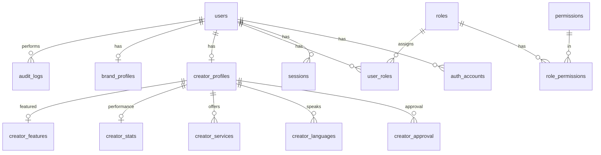

# UGC Platform – Database Schema Review

This document reviews the proposed database schema for the UGC marketplace (Brand, Creator, Admin roles) and suggests improvements.

---

## Proposed Schema Summary

### 1. Identity & Auth

| Table | Fields |
|-------|--------|
| **users** | id (uuid), email (unique), password_hash (nullable), phone, email_verified, phone_verified, status (active \| suspended \| deactivated), created_at, updated_at |
| **auth_accounts** | id, user_id, provider (google), provider_user_id, refresh_token (for future Google API), created_at — no access_token |
| **sessions** | id, user_id, refresh_token, expires_at, ip_address, user_agent, created_at |

### 2. RBAC

| Table | Fields |
|-------|--------|
| **roles** | id, name (ADMIN \| CREATOR \| BRAND) |
| **permissions** | id, name |
| **role_permissions** | role_id, permission_id |
| **user_roles** | user_id, role_id |

**Suggested Permissions (from PRD):**

- **Creator:** CREATE_PROFILE, UPLOAD_PORTFOLIO, ACCEPT_ORDER, DELIVER_CONTENT
- **Brand:** SEARCH_CREATORS, CREATE_ORDER, REQUEST_REVISION, APPROVE_DELIVERY
- **Admin:** APPROVE_CREATOR, FEATURE_LISTING, SUSPEND_USER, RESOLVE_DISPUTE, OVERRIDE_ORDER_STATUS

### 3. Profiles

| Table | Fields |
|-------|--------|
| **creator_profiles** | id, user_id (unique), display_name, city, bio, gender, age_range, travel_radius, created_at, updated_at |
| **creator_approval** | id, creator_id, status (pending \| approved \| rejected), approved_by, approved_at, rejection_reason |
| **creator_languages** | id, creator_id, language |
| **creator_services** | id, creator_id, service_type |
| **brand_profiles** | id, user_id (unique), company_name, website, industry, contact_person, created_at |

### 4. Creator Performance

| Table | Fields |
|-------|--------|
| **creator_stats** | creator_id, total_orders, completed_orders, cancelled_orders, disputes_count, avg_rating, response_time_avg, on_time_delivery_rate, acceptance_rate, updated_at |

### 5. Featured / Moderation

| Table | Fields |
|-------|--------|
| **creator_features** | id, creator_id, is_featured, featured_by, featured_until |

### 6. Audit Logs

| Table | Fields |
|-------|--------|
| **audit_logs** | id, actor_user_id, action, entity_type, entity_id, metadata (json), created_at |

---

## Relation Overview

```
User
├── UserRoles → Roles → Permissions
├── AuthAccounts
├── Sessions
├── CreatorProfile → CreatorApproval → CreatorStats
└── BrandProfile
```

---

## Pros

1. **Clear separation of concerns** – Auth, RBAC, profiles, performance, moderation, audit are distinct
2. **OAuth-ready** – `auth_accounts` supports multiple providers; `password_hash` nullable for OAuth-only users
3. **RBAC aligned with PRD** – Role-permission model maps to Creator/Brand/Admin capabilities
4. **Creator approval flow** – `creator_approval` with `approved_by`, `approved_at`, `rejection_reason` supports admin workflow
5. **No stored ranking score** – Raw signals in `creator_stats`; ranking computed dynamically
6. **Audit logs** – Supports required admin-action logging

---

## Cons and Risks

### 1. Missing Indexes and Constraints

- Likely missing indexes on: `auth_accounts(provider, provider_user_id)`, `sessions(user_id)`, `sessions(refresh_token)`, `user_roles(user_id)`, `creator_approval(creator_id)`, `audit_logs(actor_user_id)`, `audit_logs(created_at)`

### 2. Session Security

- Storing raw `refresh_token` in sessions is risky
- Prefer storing `refresh_token_hash` (SHA-256) or a token ID; verify against stored hash

### 3. Multi-role Semantics

- `user_roles` allows multiple roles per user
- No rule for Brand+Creator; context-switching is undefined
- Consider `users.primary_role_id` for single-primary-role model

### 4. Auth Account Uniqueness

- Add `UNIQUE(provider, provider_user_id)` so the same Google account is not linked more than once

### 5. Soft Delete

- `status = deactivated` exists, but no `deleted_at`
- Add `deleted_at` where soft delete and audit retention are needed

### 6. Creator Approval History

- `creator_approval` can mean: one row per creator (current) vs many rows (history)
- Clarify: current-only vs approval history

### 7. Creator Services

- `service_type` – enum vs free text
- Normalize with `service_types` table + junction for consistency

### 8. Audit Log Growth

- High write volume can make `audit_logs` large
- Consider partitioning by `created_at` or archiving old data

---

## Recommended Improvements

| Area | Change |
|------|--------|
| **auth_accounts** | Add `UNIQUE(provider, provider_user_id)` |
| **sessions** | Store `refresh_token_hash` instead of raw token; index `(user_id, expires_at)` |
| **users** | Add `primary_role_id` if multi-role is allowed |
| **creator_approval** | Decide history vs current-only; optionally add `creator_profiles.approval_status` |
| **creator_services** | Normalize with `service_types` + junction table |
| **audit_logs** | Add indexes: `(actor_user_id, created_at)`, `(entity_type, entity_id)`, `(created_at)` |
| **Soft delete** | Add `deleted_at` on `users` (and others as needed) |
| **Enums** | Use Prisma enums for `status`, `provider`, approval status, etc. |

---

## Entity Relation Diagram



---

## Summary

**Strengths:** Clear structure, OAuth support, RBAC tied to PRD, creator approval flow, dynamic ranking, and audit trail.

**Focus areas:** Session security, auth uniqueness, multi-role behavior, approval model, and indexes for performance.
